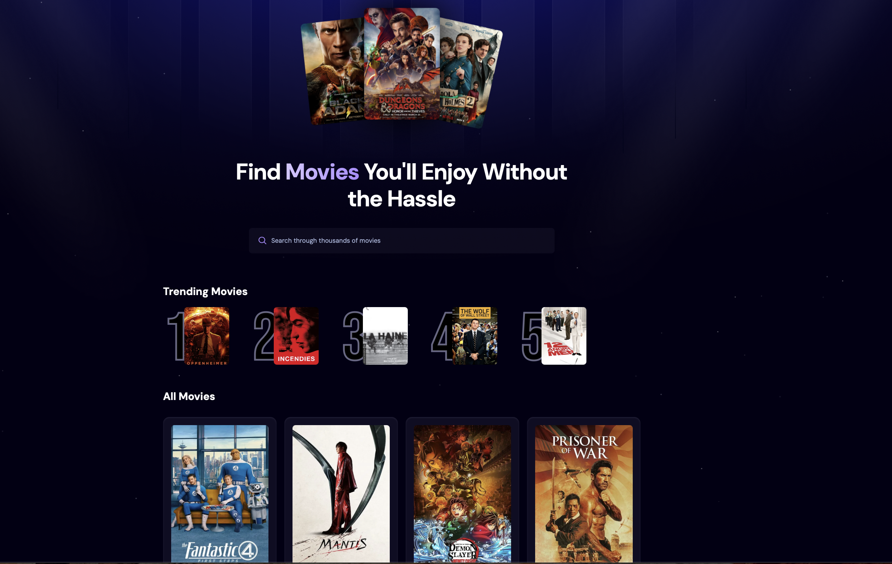

# My First Full Stack Project
I watched a youtube course to help me make this project. It is my first full stack projet.

**Link to project:** Coming Soon!

## How It's Made:

**Tech used:** HTML, CSS, JavaScript, React, Tailwind CSS, API Implementation, Appwrite Database

I used React as the main framework for this project. I used an API called The Movie Database to get all the information about every movie. It is a very extensive database with a lot of movies and a lot of information about each movie. I also used Appwrite to host a database that tracks what people are searching on my website. This allows me to display the top 5 most trending searches.

## Optimizations

For the search bar, I used a feature called debouncing. This feature makes it so that the API is not being called every single time the search item is modified. Debouncing waits 500ms until after the user has stopped typing to actually make the API call. This makes the searching feature visually and technically smoother and more optimized.

## Lessons Learned:

Because this was my first full stack project I learned a lot. My experience prior to starting this project was very surface level. I knew html, css, and javascript but this was my first time using a framework such as React. I learned how Tailwind CSS works which helps streamline the development process a lot. Although I have learned about databases and have used SQL before, this was my first time implementing a database into a web app. Overall this project was an amazing learning experience!
